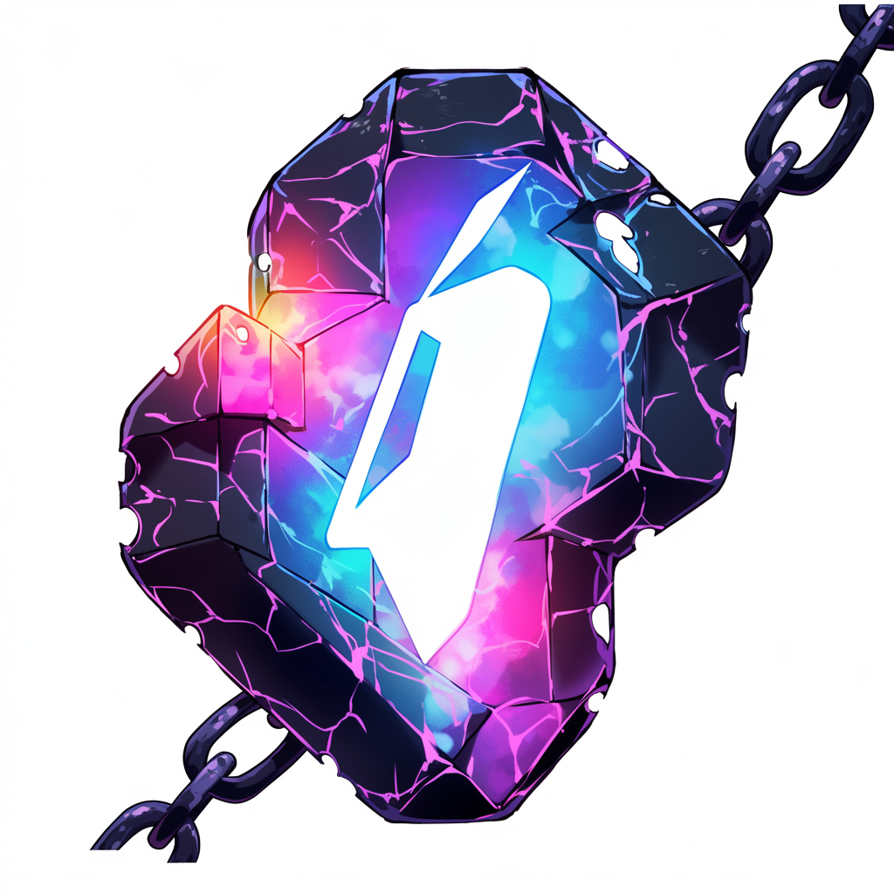
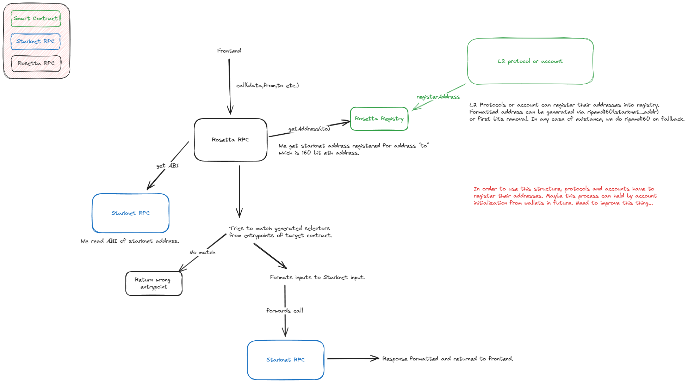

  

  **Ethereum <> Starknet RPC middleware.**

  [![Exploration_Team](https://img.shields.io/badge/Exploration_Team-29296E.svg?&style=for-the-badge&logo=data:image/svg%2bxml;base64,PD94bWwgdmVyc2lvbj0iMS4wIiBlbmNvZGluZz0iVVRGLTgiPz48c3ZnIGlkPSJhIiB4bWxucz0iaHR0cDovL3d3dy53My5vcmcvMjAwMC9zdmciIHZpZXdCb3g9IjAgMCAxODEgMTgxIj48ZGVmcz48c3R5bGU+LmJ7ZmlsbDojZmZmO308L3N0eWxlPjwvZGVmcz48cGF0aCBjbGFzcz0iYiIgZD0iTTE3Ni43Niw4OC4xOGwtMzYtMzcuNDNjLTEuMzMtMS40OC0zLjQxLTIuMDQtNS4zMS0xLjQybC0xMC42MiwyLjk4LTEyLjk1LDMuNjNoLjc4YzUuMTQtNC41Nyw5LjktOS41NSwxNC4yNS0xNC44OSwxLjY4LTEuNjgsMS44MS0yLjcyLDAtNC4yN0w5Mi40NSwuNzZxLTEuOTQtMS4wNC00LjAxLC4xM2MtMTIuMDQsMTIuNDMtMjMuODMsMjQuNzQtMzYsMzcuNjktMS4yLDEuNDUtMS41LDMuNDQtLjc4LDUuMThsNC4yNywxNi41OGMwLDIuNzIsMS40Miw1LjU3LDIuMDcsOC4yOS00LjczLTUuNjEtOS43NC0xMC45Ny0xNS4wMi0xNi4wNi0xLjY4LTEuODEtMi41OS0xLjgxLTQuNCwwTDQuMzksODguMDVjLTEuNjgsMi4zMy0xLjgxLDIuMzMsMCw0LjUzbDM1Ljg3LDM3LjNjMS4zNiwxLjUzLDMuNSwyLjEsNS40NCwxLjQybDExLjQtMy4xMSwxMi45NS0zLjYzdi45MWMtNS4yOSw0LjE3LTEwLjIyLDguNzYtMTQuNzYsMTMuNzNxLTMuNjMsMi45OC0uNzgsNS4zMWwzMy40MSwzNC44NGMyLjIsMi4yLDIuOTgsMi4yLDUuMTgsMGwzNS40OC0zNy4xN2MxLjU5LTEuMzgsMi4xNi0zLjYsMS40Mi01LjU3LTEuNjgtNi4wOS0zLjI0LTEyLjMtNC43OS0xOC4zOS0uNzQtMi4yNy0xLjIyLTQuNjItMS40Mi02Ljk5LDQuMyw1LjkzLDkuMDcsMTEuNTIsMTQuMjUsMTYuNzEsMS42OCwxLjY4LDIuNzIsMS42OCw0LjQsMGwzNC4zMi0zNS43NHExLjU1LTEuODEsMC00LjAxWm0tNzIuMjYsMTUuMTVjLTMuMTEtLjc4LTYuMDktMS41NS05LjE5LTIuNTktMS43OC0uMzQtMy42MSwuMy00Ljc5LDEuNjhsLTEyLjk1LDEzLjg2Yy0uNzYsLjg1LTEuNDUsMS43Ni0yLjA3LDIuNzJoLS42NWMxLjMtNS4zMSwyLjcyLTEwLjYyLDQuMDEtMTUuOGwxLjY4LTYuNzNjLjg0LTIuMTgsLjE1LTQuNjUtMS42OC02LjA5bC0xMi45NS0xNC4xMmMtLjY0LS40NS0xLjE0LTEuMDgtMS40Mi0xLjgxbDE5LjA0LDUuMTgsMi41OSwuNzhjMi4wNCwuNzYsNC4zMywuMTQsNS43LTEuNTVsMTIuOTUtMTQuMzhzLjc4LTEuMDQsMS42OC0xLjE3Yy0xLjgxLDYuNi0yLjk4LDE0LjEyLTUuNDQsMjAuNDYtMS4wOCwyLjk2LS4wOCw2LjI4LDIuNDYsOC4xNiw0LjI3LDQuMTQsOC4yOSw4LjU1LDEyLjk1LDEyLjk1LDAsMCwxLjMsLjkxLDEuNDIsMi4wN2wtMTMuMzQtMy42M1oiLz48L3N2Zz4=)](https://github.com/keep-starknet-strange)

## Overview

Rosettanet is a middleware aiming to provide a simple and efficient way to interact with Starknet from Ethereum based libraries and applications.

## Project structure

### Contracts

The contracts are located in the `contracts/` directory. It's a `scarb` project, so you can use the `scarb` CLI to build it.

It uses `Starknet Foundry` for tests.

See the [contracts README](contracts/README.md) for more information.

### RPC Server

See the [RPC README](src/README.md) for more information.

## Architecture

Here is a high-level overview of the architecture of Rosettanet:

